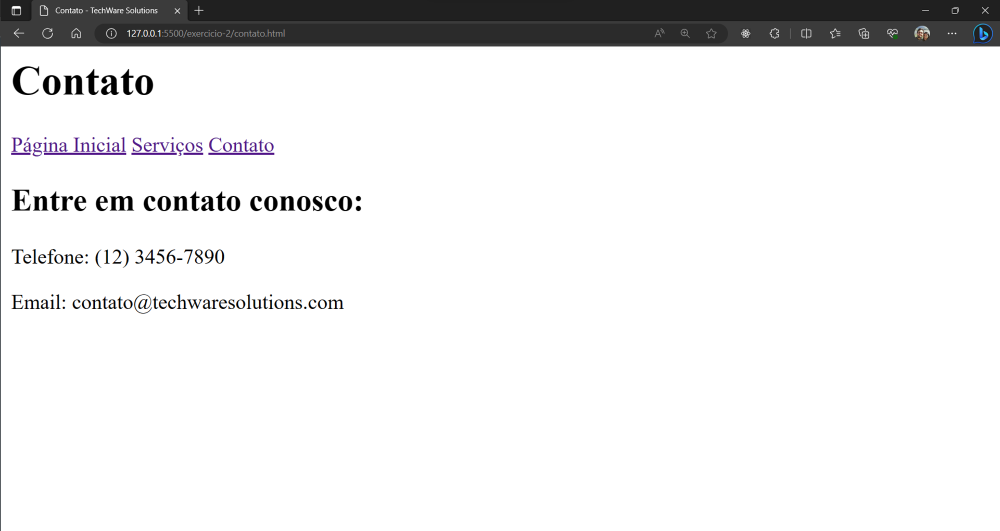

# Exercício 2 - Criando um Site com Navegação

Você foi encarregado de criar a estrutura inicial em HTML de um site para uma empresa de soluções de tecnologia.

Crie um site usando HTML e as imagens e textos abaixo como referência. O site deverá possuir 3 páginas, início, serviços e contato, e também deverá permitir a navegação entre essas páginas.

## Textos usados:

**Página inicial:** TechWare SolutionsBem-vindo à TechWare SolutionsNós somos especializados em soluções de tecnologia para empresas de todos os tamanhos.Oferecemos serviços personalizados para atender às necessidades específicas do seu negócio.

**Página de serviços:** Desenvolvimento de SoftwareOferecemos soluções de software personalizadas para atender às necessidades específicas do seu negócio.Consultoria em TINossa equipe de especialistas em TI oferece consultoria e orientação para ajudar sua empresa a obter o máximo de suas tecnologias.Suporte TécnicoGarantimos um suporte técnico ágil e eficiente para resolver problemas e manter suas operações funcionando sem interrupções.

**Página de contato:** Entre em contato conosco:Telefone: (12) 3456-7890Email: contato@techwaresolutions.com

## Imagens do resultado:
()
()
()